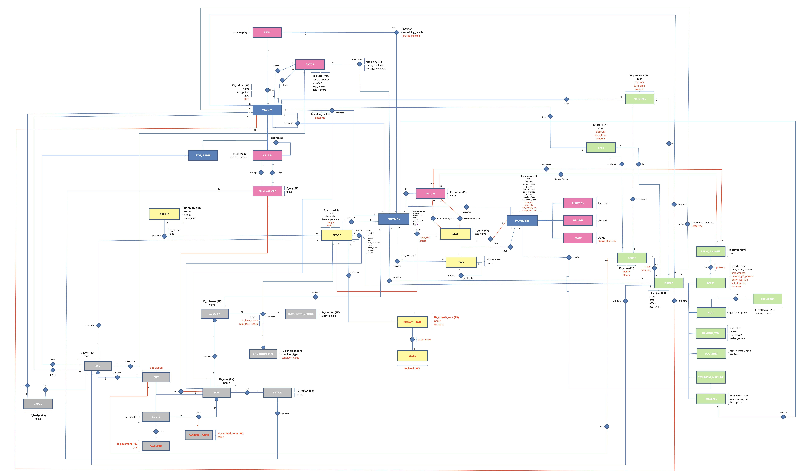
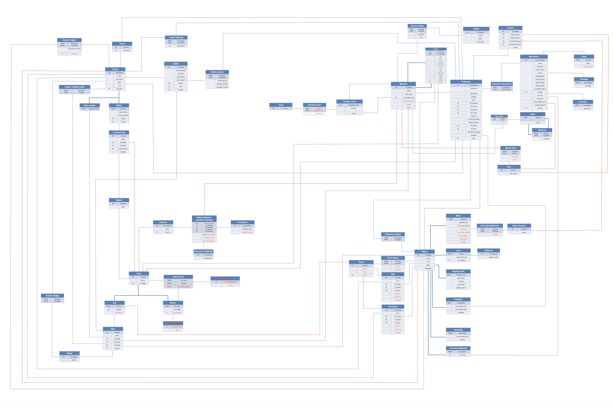

# BBDD_S2
Databases project where given a context and some CSV files, we had to design a DB model, create and fill its tables, create relations between the tables and do a series of queries on the final DB model. 

The created DB models seeks to implement a database for a Pokemon game. 

ENTITY-RELATION MODEL

RELATIONAL MODEL

# Authors
[Pol Valero] (https://github.com/pol-valero)

[Aaron Fort] (https://github.com/AaronFortG)

[Gemma Yebra] (https://github.com/gemma33y)

[Alex Liu] (https://github.com/Alello23)

[Marcos Ruiz] (https://github.com/marcos0208)